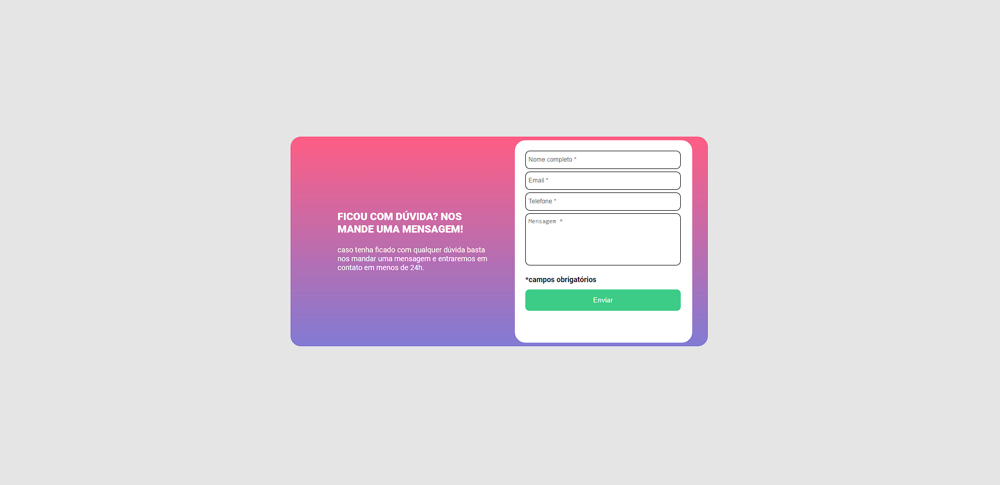
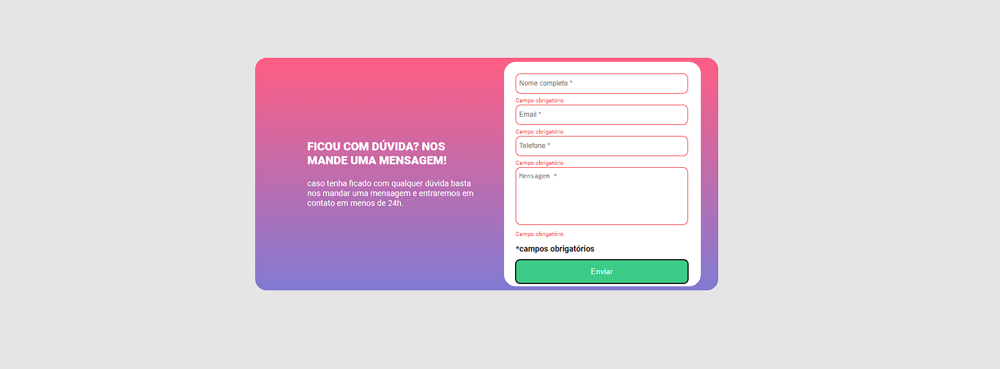

# Contact submission form 

Overview
Screenshot

the project is a simple contact submission form. 

Links
Solution URL: [Contact submission form](p)

My process
Built with
HTML5
CSS custom properties
Javascript for the interactions.

What I learned:
I learned to use Javascript functions to readjust information according to screen interactions.

Author
Github - [Wanderson Viana](https://github.com/Wandsv0)